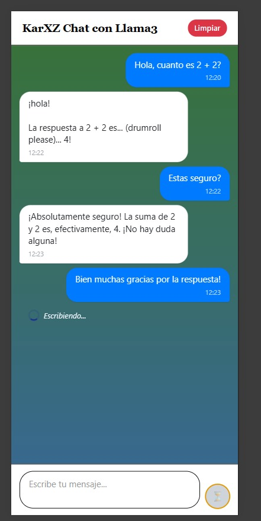

# 🤖 Chat App con Llama3 - React Native

Una aplicación de chat móvil que se conecta directamente con **Ollama** para conversar con **Llama3** de forma local.

## 📱 Vista Previa




## ✨ Características

- **💬 Chat en tiempo real** con Llama3
- **🎨 Interfaz moderna** estilo WhatsApp 
- **⏰ Timestamps** en todos los mensajes
- **🔄 Auto-scroll** a nuevos mensajes
- **⚡ Loading states** y manejo de errores
- **🧹 Limpiar historial** de chat
- **📱 Responsive** para iOS y Android

## 🚀 Inicio Rápido

### 1️⃣ Instalar Ollama

```bash
# macOS
brew install ollama

# Linux
curl -fsSL https://ollama.ai/install.sh | sh

# Windows
# Descargar desde https://ollama.ai
```

### 2️⃣ Ejecutar Llama3

```bash
ollama pull llama3
ollama serve
```

### 3️⃣ Clonar y Ejecutar

```bash
git clone https://github.com/tu-usuario/chat-app-llama3.git
cd chat-app-llama3
npm install

# iOS
npx react-native run-ios

# Android  
npx react-native run-android
```

## 🔧 Configuración

### Cambiar Modelo

En `App.tsx`, línea 65:

```typescript
body: JSON.stringify({
  model: 'llama3',           // 👈 Cambia aquí
  messages: newMessages,
  stream: false,
}),
```

### Cambiar URL de Ollama

Si Ollama está en otro servidor:

```typescript
const response = await fetch('http://TU_IP:11434/api/chat', {
  // ...resto de configuración
});
```

## 📋 Requisitos

- **Node.js** 18+
- **React Native CLI** o **Expo**
- **Ollama** ejecutándose en puerto 11434
- **iOS Simulator** / **Android Emulator**

## 🛠️ Tecnologías

- **React Native** - Framework móvil
- **TypeScript** - Tipado estático
- **Ollama API** - Backend de IA local
- **Llama3** - Modelo de lenguaje

## 📱 Plataformas Soportadas

- ✅ iOS 11+
- ✅ Android 7.0+ (API 24)

## 🔍 Estructura del Proyecto

```
src/
├── App.tsx              # Componente principal
├── types/
│   └── Message.ts       # Tipos TypeScript
└── styles/
    └── styles.ts        # Estilos globales
```

## 🐛 Solución de Problemas

### Error de conexión

```
Error: Network request failed
```

**Solución:** Verifica que Ollama esté ejecutándose:

```bash
curl http://localhost:11434/api/tags
```

### El modelo no responde

```
Error del servidor: 404
```

**Solución:** Instala el modelo:

```bash
ollama pull llama3
```

### iOS no conecta a localhost

En iOS Simulator, usa la IP de tu Mac:

```typescript
const response = await fetch('http://192.168.1.XXX:11434/api/chat', {
```

## 📄 Licencia

MIT License - ve el archivo [LICENSE](LICENSE) para más detalles.

---

<div align="center">

**¿Te gusta el proyecto?** ⭐ Dale una estrella

[Reportar Bug](https://github.com/tu-usuario/chat-app-llama3/issues) • 
[Solicitar Feature](https://github.com/tu-usuario/chat-app-llama3/issues) • 
[Contribuir](CONTRIBUTING.md)

</div>